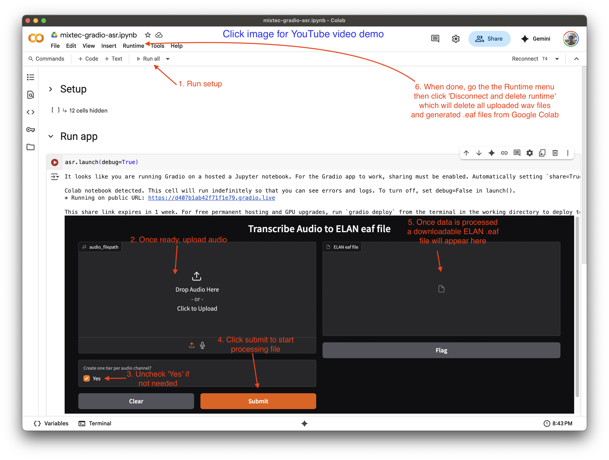

# u2u-asr: User-to-User Automatic Speech Recognition

This repository is a work-in-progress/proof-of-concept for a set of (mainly Python) scripts for going from preparing user data for ASR training to using a trained ASR model in the most user-friendly way possible.
The 'user-to-user' bit is a play on 'end-to-end ASR' and a jest at other ends, where the former/starting 'end' is sometimes 'Download and install this repository from GitHub' and the latter/output 'end' is a trained ASR system that can only be run on a university compute cluster (i.e. not by the end user).

## Goal

The technology landscape has changed a whole lot since 2016 when the [Elpis project](https://github.com/CoEDL/elpis) first started.
In 2025, we now have:
- efficient, pre-trained multilingual transformer models (e.g. [`mHuBERT-147`](https://www.isca-archive.org/interspeech_2024/zanonboito24_interspeech.pdf)) that can be quickly fine-tuned for ASR with very little transcribed speech
- limited but sufficient for fine-tuning and free GPU usage on Google Colab (a small T4 instance for ~3 hours)
- [`transformers.js`](https://huggingface.co/docs/transformers.js/en/index) which can run fine-tuned models locally in the browser
- [Pyodide](https://pyodide.org/en/stable/) which lets your web browser can run Python scripts (i.e. for data preparation).

Given this landscape, it should nominally be possible put such things together for the following user-to-user workflow (or at least some parts of it).

## Phase 1: Mixtec Prototype

I am currently working with Jonathan Amith to create a Yolóxochitl Mixtec ASR system that he can run on his own without my assistance.
Since his and Rey Castillo García's Yolóxochitl Mixtec ASR corpus is openly available (https://www.openslr.org/89/), and that these contain the raw audio 48 kHz stereo audio recordings and ELAN .eaf files, this corpus can be used by others to try out the workflow for themselves (before perhaps using their own data).

As not to get bogged down by technicalities such as 'Okay but how do I actually get Pyodide and Transformers.js to play nicely together and how do I accept user audio via browser upload via Javascript to pass onto the local ASR model?' (neither of which I have currently figured out), the current deployment simply relies on Google Colab for inference (address bar/link intentionally hidden; click for demo YouTube video, using a 1-minute, 16 kHz file to reduce upload time for quick demo).

### 2025-06-20 files
- `01_prepare-data_mixtec.ipynb`: Jupyter notebook preparing the Mixtec data from raw 48 kHz stereo wav files with ELAN .eaf annotations into ASR training data
- `02_finetune-mhubert.py`: script for fine-tuning mHuBERT-147 for ASR using prepared data
- `03_colab-gradio.deploy.ipynb`: Jupyter notebook equivalent to Colab video demo (minus the downloading of the real Mixtec model).

# Acknowledgments

This work in this repository relies on a lot of great work by:
- Jonathan Amith and Rey Castillo García, as mentioned, for making the [Yolóxochitl Mixtec ASR corpus](https://www.openslr.org/89/) is openly available
- Marcely Zanon Boito and co for training and releasing [mHuBERT-147](https://huggingface.co/utter-project/mHuBERT-147)
- Zhaoheng Ni's easy-to-understand HuBERT pre-training and fine-tuning code in [torchaudio examples](https://github.com/pytorch/audio/tree/main/examples/self_supervised_learning)
- Mart Lubbers and Francisco Torreira's [`pympi`](https://github.com/dopefishh/pympi) library for processing ELAN .eaf files (and Praat .TextGrid files, for that matter)
- Piotr Żelasko and co's [Lhotse](https://github.com/lhotse-speech/lhotse) library for making speech data seamlessly integrate with PyTorch for speech model training
- Alexander Veysov and co for making the excellent [Silero-VAD](https://github.com/snakers4/silero-vad) for voice activity detection
